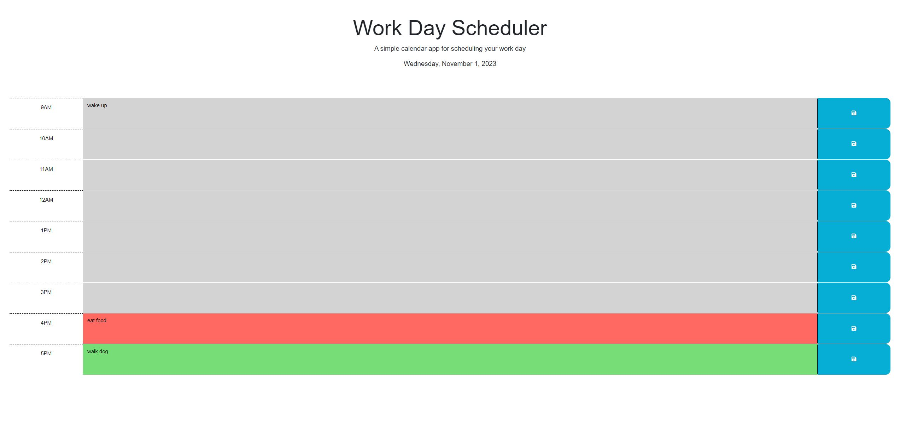

## Description:
The Work Day Scheduler creates an easy and effient way for anyone to manage their busy schedule. You can document all events for the day in your planer. It's easy to keep track of events with these color boxes. Red indicaates the current time,  grey indicates the past and green indicates the future. By having these boxes color coordinated it makes it visually easy for clients to keep track of the their time and events. 

## Solution URL:
[Work Day Scheduler URL Link:](https://kenwong356.github.io/Work-Day-Scheduler/))

## Screenshot:
### Figure 1. Screenshot
 

